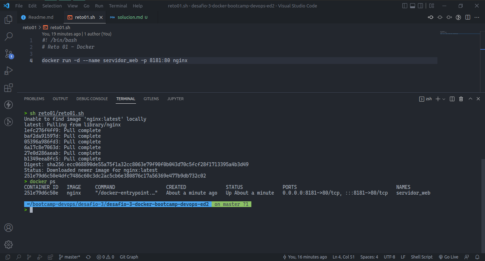
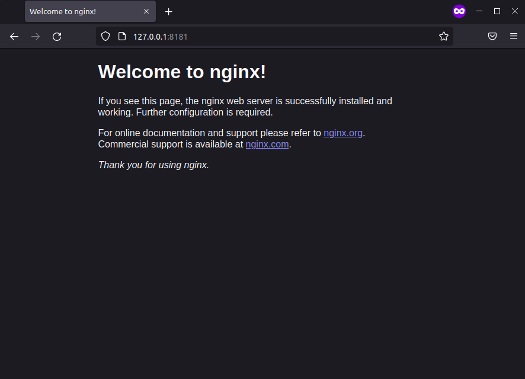
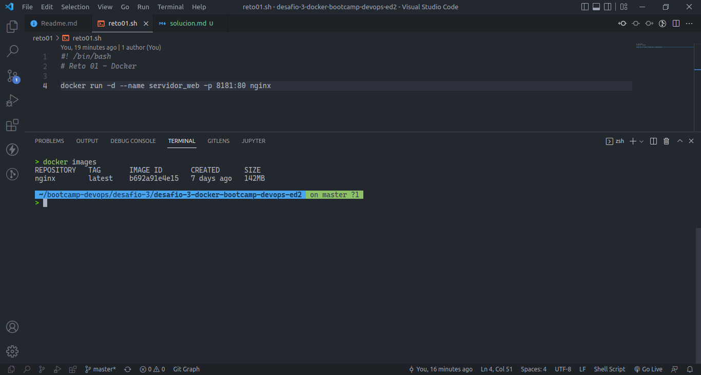
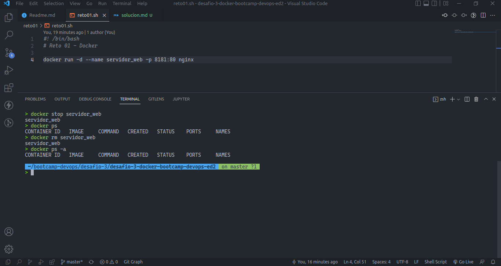

# Solución Reto 01 - BootCamp DevOps ED2

- Script Shell para crear el contenedor: [Aqui](reto01.sh)
- Pantallazo donde se vea la creación del contenedor y podamos comprobar que el contenedor está funcionando:

- Pantallazo donde se vea el acceso al servidor web utilizando un navegador web (recuerda que tienes que acceder a la ip del ordenador donde tengas instalado docker)

- Pantallazo donde se vean las imágenes que tienes en tu registro local.

- Pantallazo donde se vea cómo se elimina el contenedor (recuerda que antes debe estar parado el contenedor).

