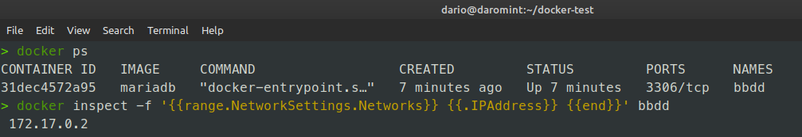

# Solución Reto 02 - BootCamp DevOps ED2

1. Arrancar un contenedor que se llame `bbdd` y que ejecute una instancia de la imagen mariadb para que sea accesible desde el puerto 3306. Establecer variables de entorno.

- Script Shell para crear el contenedor: [Aqui](reto02.sh)
- Pantallazo donde se vea la creación del contenedor en primer plano:

2. Pantallazo de la conexión al servidor de base de datos con el usuario creado y de la base de datos `prueba` creada automáticamente.

- Para poder acceder a la bd `prueba` mediante un gestor debemos ver que IP tiene el contenedor ya que el mismo esta aislado del host por lo que para ver la IP ejecutamos el siguiente comando:

- Verificamos la conexión mediante el gestor DBeaver Community:.

- Pantallazo, acceso a la bd `prueba` :

3. Pantallazo donde se comprueba que no se puede borrar la imagen `mariadb` mientras el contenedor `bbdd` está creado:
