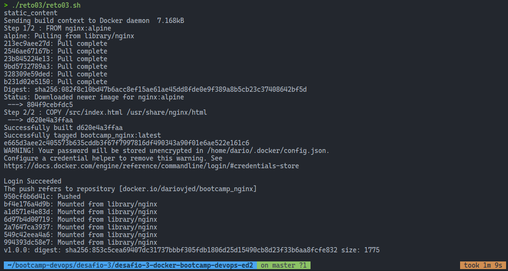
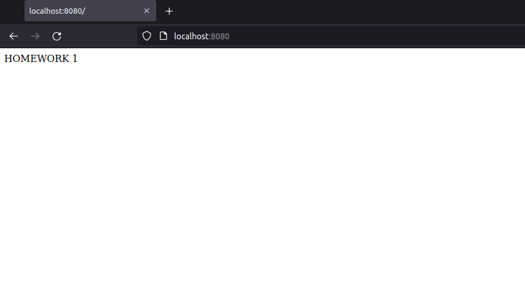
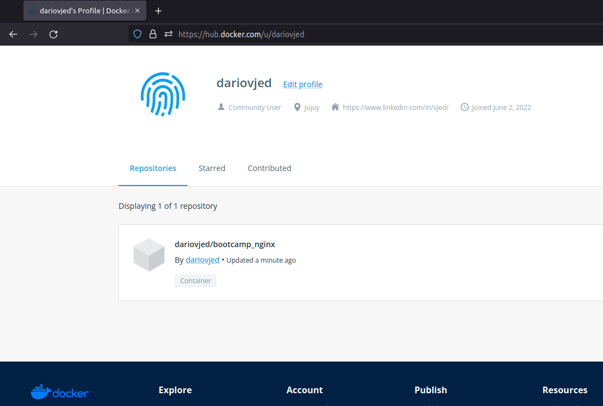
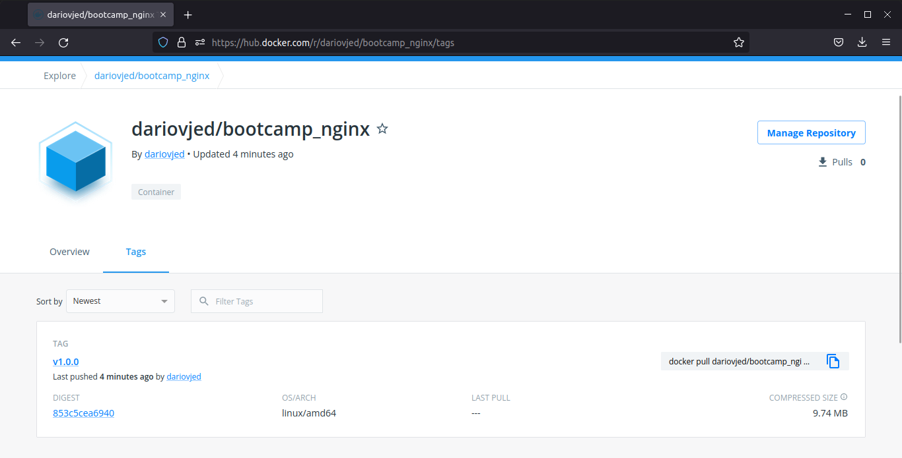

# Solución Reto 03 - BootCamp DevOps ED2

## Crea un contenedor con las siguientes especificaciones:
	a. Utilizar la imagen base NGINX haciendo uso de la version nginx:alpine
	b. Al acceder a la URL localhost:8080/index.html aparecer el mensaje HOMEWORK 1
	c. Persistir el fichero index.html en un volumen llamado static_content

### Script Shell para la solucion: [Aqui](reto03.sh)

### Captura de ejecutar el script

### Captura de acceder a la URL localhost:8080/index.html

### Capturas de Deploy to Registry DockerHub

