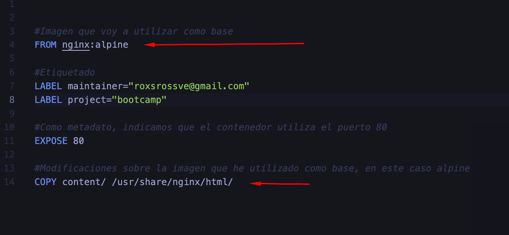
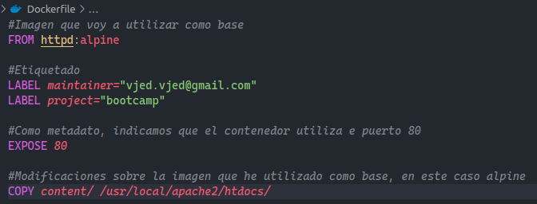
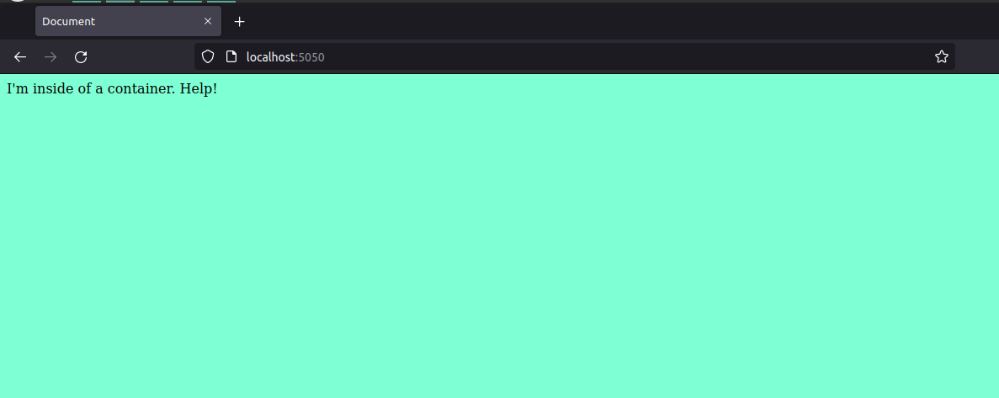
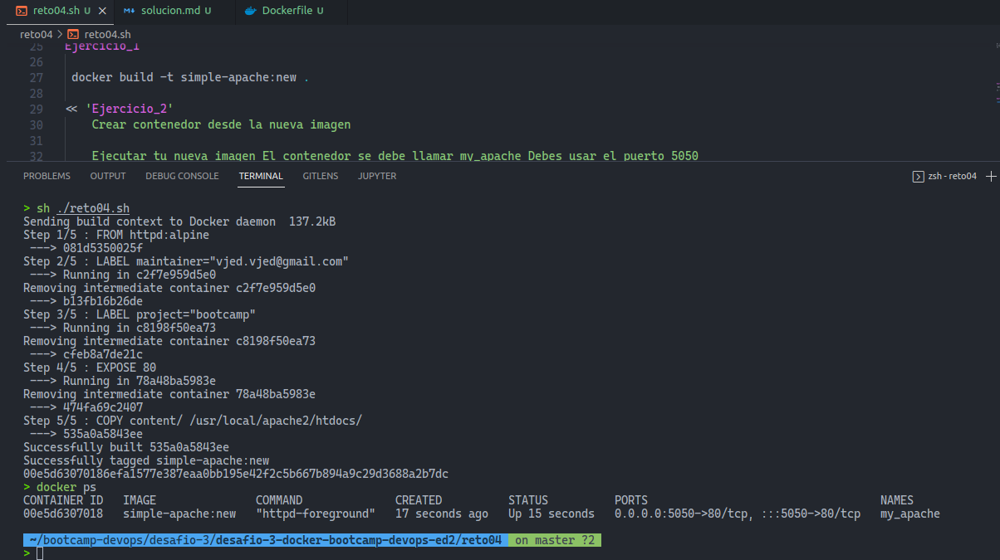

# Reto 04 - Docker

### Ejercicio 1 - Crear imagen de `Apache`
Crea una imagen con un servidor web Apache y el mismo contenido que en la carpeta content

content

├── index.html

└── site.css

En base al siguiente Dockerfile de```simple-nginx```.

cambiar los valores para que se use una imagen de apache y usa docker build para crear la imagen llamada ```simple-apache:new``

### Solucion:
Se debe cambiar la imagen a usar que es ```httpd:alpine```

```FROM httpd:alpine```

Tambien se debe modificar la ruta donde apache sirve los archivos:
```COPY content/ /usr/local/apache2/htdocs/```

El Dockerfile quedaria:



Comando para crear la imagen llamada ```simple-apache:new```:
```docker build -t simple-apache:new .```

### Ejercicio 2 - Crear contenedor desde la nueva imagen

Ejecutar tu nueva imagen
El contenedor se debe llamar ```my_apache```
Debes usar el puerto __5050__ de tu __localhost__ para poder acceder a él.

### Solucion:
Comando a ejecutar:
```docker run -d --name my_apache -p 5050:80 simple-apache:new```

Captura de pantalla:


### Script Shell que ejecuta ambos ejercicios:
[Ver Script](reto04.sh)

Captura de pantalla al ejecutar el script:

